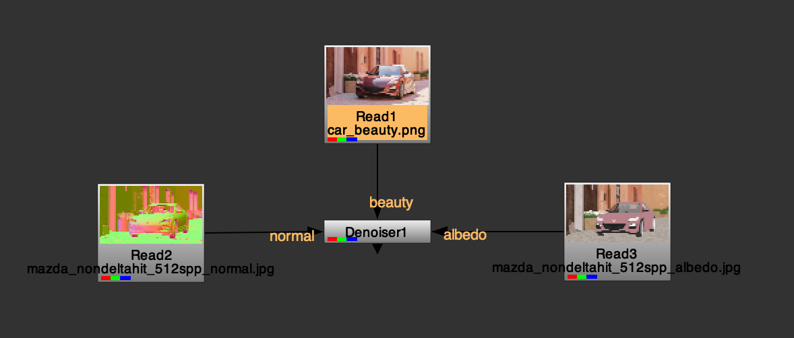

# NukeCGDenoiser



This is a Nuke plugin for denoising CG renders using Intel's OpenImageDenoise library.

[Documentation](https://github.com/mateuszwojt/NukeCGDenoiser/wiki)

## Requirements

In order to compile this plugin, you're gonna need:

- CMake 3.13 or later
- Nuke 12.x/13.x/14.x/15.x
- [Intel's OpenImageDenoise 2.x](https://github.com/RenderKit/oidn)

This plugin should compile fine on Windows, Linux and MacOS. It was tested with Nuke 15.0v2 / MacOS Ventura 13.6.1 (arm64) with Open Image Denoise v2.1.0.

## Manual build

### Linux

```
git clone https://github.com/mateuszwojt/NukeCGDenoiser.git
cd NukeCGDenoiser
mkdir build && cd build
cmake -DOIDN_ROOT=/path/to/oidn ..
make && make install
```

### Windows

```
git clone https://github.com/mateuszwojt/NukeCGDenoiser.git
cd NukeCGDenoiser
mkdir build && cd build
cmake -G "Visual Studio 14 2015 Win64" -DOIDN_ROOT=/path/to/oidn ..
cmake --build . --config Release
```

## Troubleshooting

If for some reason plugin cannot be loaded inside Nuke, make sure that you have the path to OpenImageDenoise library appened to your system's `PATH` variable.

If the plugin is crashing Nuke, please create a new issue [here on GitHub](https://github.com/mateuszwojt/NukeCGDenoiser/issues/new) with the description containing steps to reproduce the crash.

## Limitations

Currently there's no internal validation of the input AOVs resolution. If your passes are different width and height for some reason, it can introduce artifacts into the denoised image. Make sure to reformat such AOVs, so all passes are at the same image resolution.

This plugin works on a limited number of channels at the moment. Only RGB components are processed, alpha is ignored.
