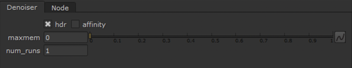

Nuke CG Denoiser
====================================================

.. toctree::
   :maxdepth: 2
   :caption: Contents:

Introduction
============

.. image:: images/denoiser_node_usage.png

Nuke CG Denoiser is a plugin for Foundry's Nuke written in C++. It allows denoising CG renders using Intel's Open Image Denoise library.

Installing OpenImageDenoise
===========================

This plugin requires OpenImageDenoise library installed in your system in order to run.

**Windows**:

1. Download the latest version of the library from the `releases page <https://github.com/OpenImageDenoise/oidn/releases>`_.
2. Extract the binaries into some location.
3. Go to **Start**, **Edit environment variables for your account**.
4. Create (or edit existing one) a new variable called ``Path``. Set the value to the location where you extracted the library, i.e. ``C:\oidn-1.4.2.x64.vc14.windows\bin``

.. warning::
   ``Path`` on Windows needs to specifically point to the ``bin`` directory, where the ``OpenImageDenoise.dll`` resides.

**Linux**:

1. Download the latest version of the OIDN library from the `releases page <https://github.com/OpenImageDenoise/oidn/releases>`_.
2. Extract the binaries into some location.
3. Edit your ``.bashrc`` or ``.zshrc``, add the path to the library to the ``PATH`` variable:

.. code-block:: bashrc

   export PATH="/path/to/oidn/bin:$PATH"

**MacOS**

On MacOS, the easiests way to install OIDN is to use `Homebrew <https://brew.sh/>`_.

Use the following command to download the precompiled build to your machine:

.. code-block:: bashrc

   brew install open-image-denoise

Installing the plugin
=====================

1. Go to the `Release <https://gitlab.com/mateuszwojt/nukecgdenoiser/-/releases>`_ page of the plugin's repository.
2. Download the binary package for your system (i.e. Linux)
3. Extract content of the package into ``~/.nuke/nuke-denoiser`` folder.
4. Open ``~/.nuke/init.py`` in a text editor (create the file, if it doesn't exist). Place the following line at the end:

.. code-block:: python

   nuke.pluginAddPath('nuke-denoiser')

5. Save the file, launch Nuke.
6. You should be able to create the node by hitting Tab key and typing Denoiser or using the dedicated menu.

Usage
=====

Denoiser node has three inputs for each of the AOVs that can be processed by the filter:

- **beauty** (default)
- **albedo** (optional)
- **normals** (optional)

Albedo and normals are not required, but the denoised image should improve in quality if you decide to use all three AOVs.

Parameters
==========

Denoiser node has the following knobs:

- **Device Type** - allows to select which device the denoising filter will be executed on. You can toggle between Auto, CPU, SYCL, CUDA and HIP. Not all platforms support every device type, it depends on your operating system and GPU drivers.
- **HDR** - use if the beauty input image is high-dynamic range
- **Enable thread affinity** - enables thread affinitization
- **Memory limit (MB)** - approximate maximum scratch memory to use in megabytes
- **Number of runs** - number of times the denoise filter is executed on the image
